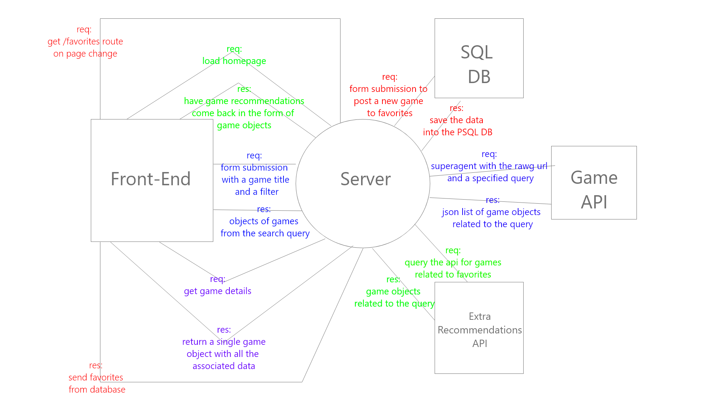

# RYS3_Tek_Pro - Robert Radford, Yoni Palagashvili, Seth Mcfeeters

## Project Description:

This application will take advantage of Steams applications web API to help better filter game searches and make recommendations based on similarity levels to titles the user already marked as liked, as well as to make the games search more user friendly for people gift shopping that aren't knowledgeable about gaming.

## Prep 1

### Communication plan:
Work on remo throughout the day, exchanged phone numbers in case we can't contact through other planned methods. 0900 set meeting time to gurantee everyone has a chance to inquire about changing directions if they want to. Made a Slack group chat as well.

### Conflict plan: 
Morning meetings to gurantee everyones voice is heard, majority rules. If its a threeway tie of indecision have a discussion and layout a roadmap for the different methods and select the most clear concise choice. If any individual still feels strongly about an idea that got skipped on or there isn't a clear "winner" of ideas after discussing we would reach out for instructor or TA approval.

### Work plan:
We will layout a blueprint, create the tasks vaguely that will be necessary to reach the end goal, and place them into a Trello board and then divide up task assignment and work through them.

### Git process: 
Create a repo with a main, staging branch, and then each of our own working branches. Whenever a task is completed and code is functional push it into staging and each morning at the end of the meeting we can push staging to main.

### Any thing else you feel is important: 
Outside work is fine but expectations are only Monday-Thursday, and approximately 8 hours a day.

### MVP blueprint

1. pull from steam apps api to get a list of games based on user query
2. render games on page with the option to add a game to your favorites
3. database of favorites that can be added to or removed from
4. add feature to the search results to make a recommendation based on similar titles to games you have favorited

</img>